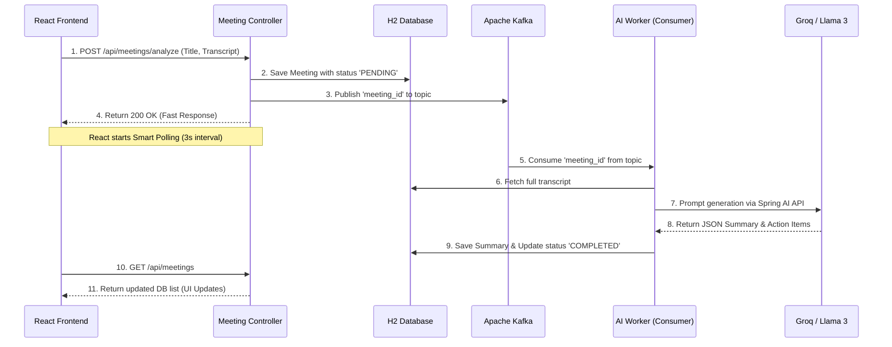

# Smart Meeting Analyzer (AI-Powered Architecture)
**A comprehensive overview for technical interviews.**

## 1. Project Objective & Core Problem Solved
Built a robust, decoupled full-stack application designed to transcribe and analyze meeting texts using a Large Language Model. 

**The Core Engineering Problem:** 
Generative AI APIs (like OpenAI or Groq) are notoriously slow, sometimes taking 5 to 30 seconds to generate a response. If a synchronous API model was used, the Java Backend would block web threads while waiting for the AI. Under heavy load, this would cause thread exhaustion and crash the server. This project solves that by utilizing an **Asynchronous, Event-Driven Architecture** via Apache Kafka to perfectly decouple high-traffic web requests from slow AI processing.

---

## 2. System Architecture Diagram

---

## 3. The Lifecycle of a Request (Data Flow)

1. **The Fast Upload:** The user uploads a transcript in the React SPA. The Spring Boot `MeetingController` receives the payload, instantly creates a database record marked as `PENDING`, and immediately returns success to the user so the UI never freezes.
2. **Event-Driven Handoff:** Just before returning, the Controller publishes the unique `UUID` of that meeting to the `meeting-transcripts` Kafka topic. This frees up Tomcat server threads to handle thousands of other incoming user requests instantly.
3. **Asynchronous Worker:** The `AIWorkerService` runs on a background thread. It listens to Kafka, grabs the UUID, reads the transcript from the database, and reaches out to the Groq Llama-3 API.
4. **The Fallback / Circuit Breaker:** If the external AI API crashes, throws a 401, or hits a rate limit, a specific Java `catch` block intercepts the exception and gracefully saves a "Mock Summary" error state. This ensures a broken 3rd-party API never crashes our own microservice.
5. **Smart Polling Engine:** On the React side, a highly optimized `useEffect` loop executes `fetch()` every 3 seconds to get live UI updates. It employs two vital, senior-level kill-switches:
    - **Bandwidth Saver:** If no items are actively `PENDING`, the network requests completely shut down to save server bandwidth.
    - **Timeout Failsafe:** If the AI task fails to complete within 10 polling intervals (30 seconds), it assumes the backend background-worker crashed, and locally flags the UI as `🚨 CRASHED` to save the user from waiting in an infinite loop.

---

## 4. Backend Architecture Deep-Dive (Spring Boot)

### Core Technologies
- **Spring Boot Web:** Exposed lightweight HTTP endpoints (`MeetingController.java`) allowing React to upload text and poll for status.
- **Spring Data JPA & H2 Database:** Utilized an in-memory SQL database for rapid state persistence (`PENDING` vs `COMPLETED`), maintaining application state durability across asynchronous operations.
- **Apache Kafka & Zookeeper (Docker):** Integrated the Spring Kafka framework to handle distributed message streaming. Zookeeper orchestrates the Kafka broker cluster, while Kafka guarantees at-least-once delivery of `meeting_id` messages.
- **Spring AI:** A unified abstraction layer replacing bespoke REST clients, dynamically routing prompt execution through the `OpenAiChatModel` client.

### Asynchronous Concurrency Profile
The backend is fundamentally modeled around a highly scalable **"Fast Producer, Slow Consumer"** message-passing topography.

1. **The Fast Producer (`KafkaProducerService.java`):**
   When the load balancer drops an HTTP request onto the JVM's Tomcat web thread pool, the backend takes fewer than `5ms` to save the request to the SQL database and write the `UUID` string directly to the Kafka `meeting-transcripts` partition. The HTTP connection is instantly closed and the Tomcat thread is released back to the Web Server pool. This means the server can effortlessly absorb massive external traffic spikes (e.g. 5,000 bulk uploads per second) without lagging or throwing `Out Of Memory` errors.
   
2. **The Slow Consumer (`AIWorkerService.java`):**
   Spring's `@KafkaListener` daemon spins up dedicated, detached background threads. It polls Kafka for unread messages, executes the highly-latent network calls to Groq's APIs over the internet, processes the JSON serialization, and executes SQL updates. Because this execution happens on an entirely decoupled thread pool, it has **zero impact** on frontend UI latency or new incoming uploads.
   
3. **Graceful Fault Tolerance and Resilience:**
   Network calls to external LLMs are inherently flaky (often encountering rate limits, 401 Quota errors, or SSL timeouts). The `AIWorkerService` wraps the `CatClient` network execution block within a strict `try-catch` boundary. If an `Exception` is thrown, the layer intercepts it, logs the exact `e.getMessage()` stack trace, and instantly engages a fallback mechanism that writes a predefined mock structured JSON packet back to the database. This guarantees the data pipeline never permanently stalls.

---

## 5. Key Interview Talking Points & Engineering Decisions

When asked about this project in an interview, emphasize the **"Why"** behind these technical decisions:

> **INTERVIEWER:** "Why did you use Apache Kafka instead of just calling the OpenAI Java client directly inside your REST Controller?"
> **YOUR ANSWER:** "If I waited for Groq's API synchronously inside my controller, an influx of merely 200 users uploading simultaneously would exhaust all 200 default Tomcat web threads. The backend would drop all new requests. By injecting Kafka, I buffered the massive web traffic into a message queue, allowing my application to seamlessly absorb extreme traffic spikes while background workers process the LLM calls at their own steady, parallelized pace."

> **INTERVIEWER:** "How did you manage switching your AI models during development?"
> **YOUR ANSWER:** "Instead of rewriting my HTTP REST clients, I utilized the **Spring AI** framework which relies heavily on interface-driven abstractions (`ChatClient`). When I needed to migrate from ChatGPT to Groq's Llama-3, I leveraged the fact that Groq is an 'OpenAI-Compatible' API. I simply overrode the `base-url` property in `application.properties` to redirect Spring Boot's internal ChatGPT payload straight to Groq. This allowed me to completely swap out the AI Engine of my entire company without changing a single line of Java code."

> **INTERVIEWER:** "Why did you choose React Polling over WebSockets for your real-time updates?"
> **YOUR ANSWER:** "While WebSockets present lower latency, building and maintaining bidirectional tunnels for a one-way architectural read-status requires massive resource and load-balancer overhead. I implemented a dynamic **Smart Polling Engine** in React—the client hits the server recursively **only** when there are active dirty inputs, and actively calls `clearInterval()` to destroy its own polling processes when the UI data is fully synced. This mimics a real-time WebSocket feel to the user, but ensures the backend remains completely stateless and infinitely horizontally scalable."
