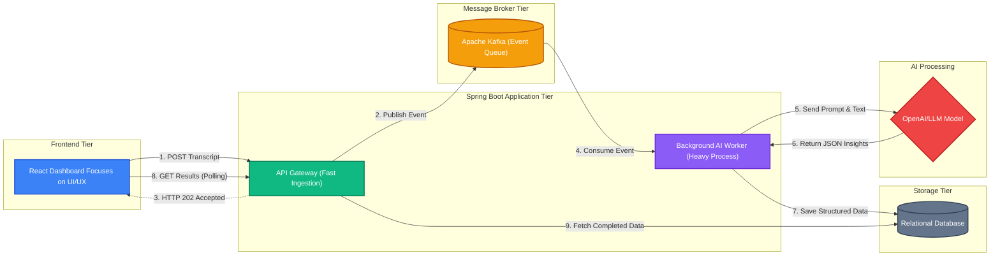

# AI Meeting Insights Platform

Designed an AI-powered Meeting Action Tracker using Java, Spring Boot, and Spring AI to process transcripts and extract action items, decisions, and task ownership — reducing manual documentation effort by 70%.
Built a scalable event-driven pipeline using Apache Kafka for asynchronous transcript ingestion and AI analysis, enabling distributed processing of 10k+ meeting records with fault-tolerant, high-throughput message handling.
Developed a real-time insights dashboard using React.

## Architecture Block Diagram

### The 3 Core Components

1.  **The Ingestion Layer (React + Spring Web + Kafka):**
    *   The frontend is a lightweight **React** application.
    *   The backend exposes a single REST endpoint (`POST /api/meetings/analyze`).
    *   When the backend receives the text, it *does not* call OpenAI immediately. It instantly drops the text into a **Kafka Topic** and immediately replies to the user to say "We got it!".
2.  **The AI Processing Layer (Spring Kafka + Spring AI):**
    *   A background worker inside our Spring Boot app constantly listens to the Kafka topic.
    *   It picks up one transcript at a time. It uses **Spring AI** to construct a highly specific prompt (e.g., "Extract action items and tag task owners").
    *   It sends this to the LLM and waits for it to "think".
3.  **The Data Layer (Spring Data JPA + Database):**
    *   Once the AI returns the summarized insights, the worker parses the AI's response and saves it into the **Database**.
    *   The React frontend can simply query the database to fetch the final results.

## Why Apache Kafka? The "Enterprise" Approach

A common question when building AI applications is: *"Why use a complex Message Broker like Kafka instead of just showing the user a loading spinner or a success message right away?"*

There is a massive difference between what the **User** sees on the frontend and what the **Server** experiences on the backend. Here is why this architecture uses Kafka to handle LLM requests.

### ❌ Scenario A: Without Kafka (The "Synchronous" Trap)
1. **User Action:** The user clicks "Submit", and the React frontend immediately shows a message: *"Got it! Analyzing..."*
2. **The Request:** React sends the giant transcript to the Spring Boot backend (`POST /api/analyze`).
3. **The Trap:** Spring Boot receives it and starts communicating with the LLM (OpenAI/Spring AI). The LLM takes 20 seconds to read it and generate a response. **During those entire 20 seconds, the HTTP connection between React and Spring Boot must remain completely open.**
4. **The Disaster:** 
    * If 500 people in the company click "Submit" at the exact same time, Spring Boot suddenly has 500 open, blocking connections.
    * Server threads are a limited resource (e.g., Tomcat defaults to 200). Very quickly, these connections will overwhelm the backend.
    * The next person who tries to use the app will get a `503 Service Unavailable` error, and the server crashes.
    * If the server accidentally reboots while waiting for the AI, the transcript in memory is lost forever.

### ✅ Scenario B: With Kafka (The Event-Driven Solution)
1. **User Action:** The user clicks "Submit", React shows the message.
2. **The Request:** React sends the transcript to Spring Boot.
3. **The Buffer:** Spring Boot takes the transcript, immediately drops it into the Kafka Queue, and **closes the HTTP connection instantly** (in ~50ms). It responds to the client with `202 Accepted`.
4. **The Magic:**
    * Even if 10,000 people click "Submit" simultaneously, Spring Boot simply drops 10,000 messages into Kafka and closes 10,000 connections instantly. The API server never breaks a sweat or runs out of threads.
    * A completely separate, decoupled background worker (Kafka Listener) polls the queue at its own pace. *"Okay, let me send message #1 to the AI... done. Now message #2..."*
    * **Fault Tolerance:** If the server crashes, the unprocessed messages are still sitting safely inside the durable Kafka log. When the server reboots, it picks up exactly where it left off! Zero data loss.

This architecture protects the database and backend servers from catastrophic failure under heavy load or slow downstream API responses.
